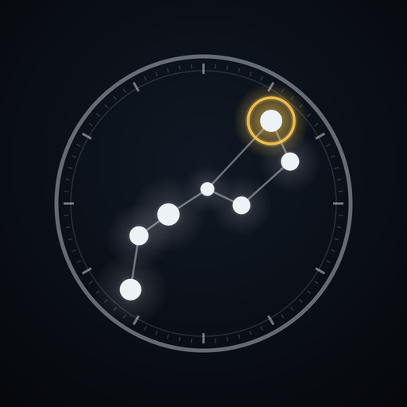
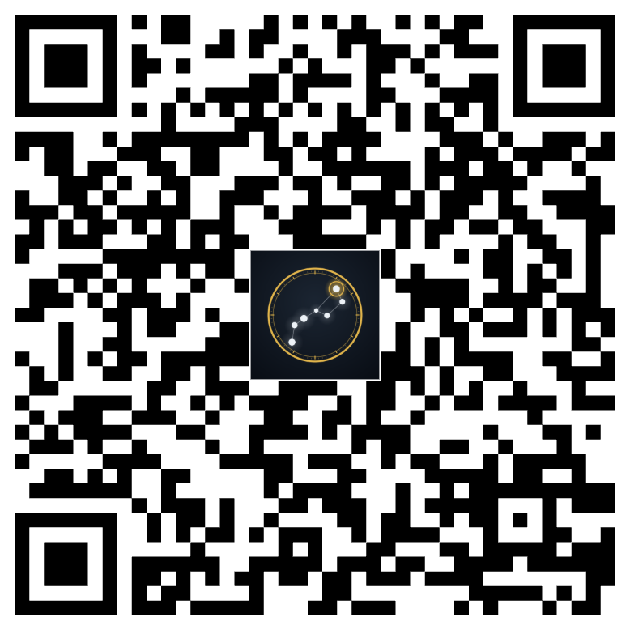
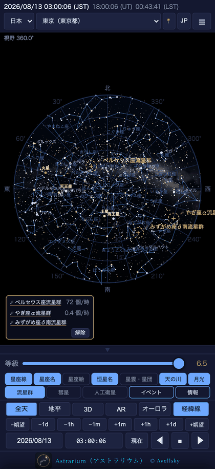
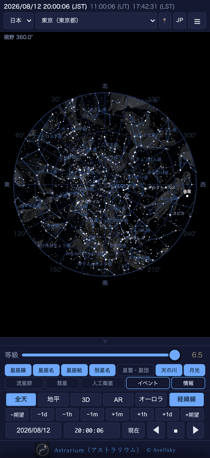
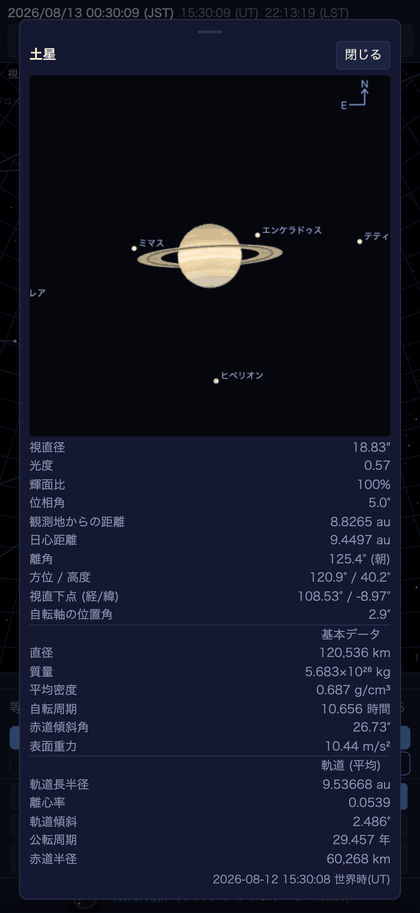
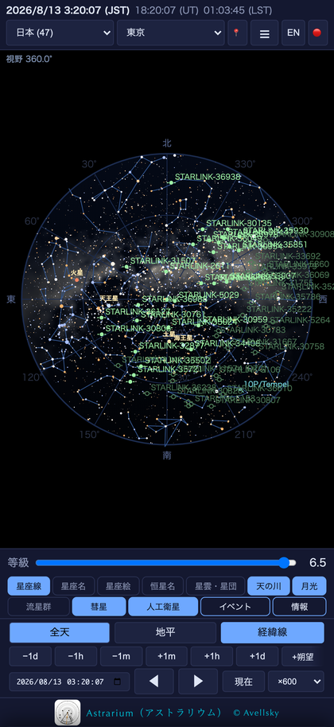
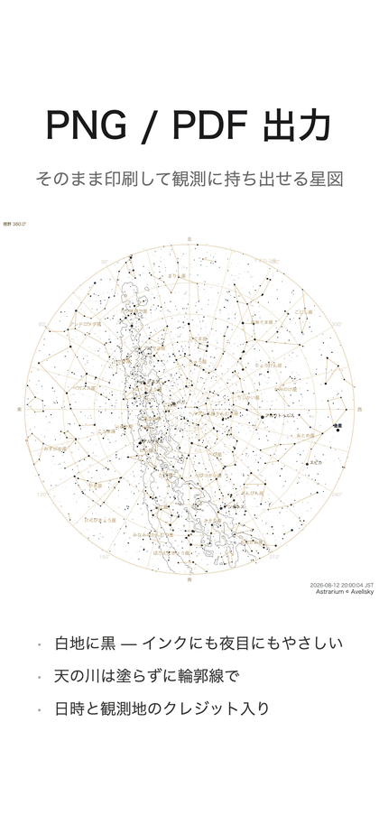
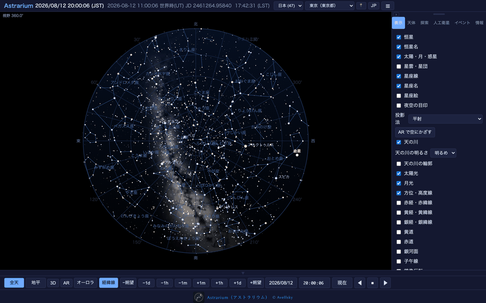
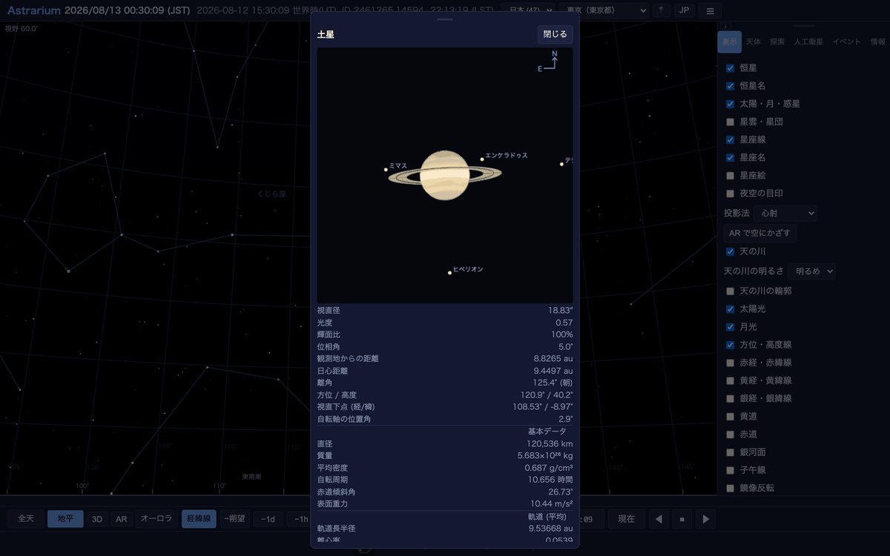

# Astrarium（アストラリウム）

**星図とプラネタリウム — 観測地と日時を決めれば、その空をそのまま描きます**

iPhone・iPad・Mac 対応／無料／広告なし・アプリ内課金なし・アカウント登録なし

### [📲 App Store で入手する](https://apps.apple.com/jp/app/id6795053748)

[日本語](#astrariumアストラリウム) ・ [English](#astrarium)

---

## 画面

  
  
  
  
  

## できること

- **全天モードと地平モード** — 星座早見盤と同じ丸い全天図と、実際に空を見上げたときに近い地平図
- **時刻を自由に動かす** — 任意の日時へジャンプ、1 倍から 6000 倍までの段階再生、朔望月送り、時刻を完全に止める停止ボタン
- **天体をタップすれば、その場の数値** — 方位・高度・座標・距離・出没時刻が、時計を動かすとそのまま追従します
- **惑星の拡大表示** — 視直径・輝面比・距離・軌道要素、基本物理量（直径・質量・密度・自転周期・赤道傾斜角・表面重力）、木星／土星／火星の衛星の配置
- **月** — 月齢・輝面比・秤動・欠け際、満月の呼称（ピンクムーン、スーパームーンなど）
- **極軸合わせ** — 北極星を選ぶと極軸望遠鏡の視野を再現。時角の目盛環の上で、いま北極星をどこに入れるかが分かります
- **流星群カレンダー** — 極大日時、輻射点高度、月明かりを織り込んだ予想出現数
- **人工衛星** — CelesTrak の軌道要素を取得して ISS・天宮などの通過を表示、可視パス予報つき
- **彗星・小惑星** — MPC／JPL から軌道要素を取得して星図に重ねる
- **イベント一覧** — 天体イベント全般のほか、掩蔽・恒星食、肉眼で見える人工衛星、日食・月食を選んで一覧。後の三つは**その観測地から実際に見えるものだけ**を示します
- **4 種の経緯線**、天の赤道・黄道・銀河面・子午線、写野角枠（Seestar・DWARF・カメラレンズ）
- **ナイトモード**（赤色画面）、**長時間露光**、**PNG／PDF 出力**（白背景の印刷用配色）、字幕つきデモ再生
- **日本語と英語** — 天体名・星座名・星雲星団の解説まで、どちらでも読めます（恒星の固有名は日本語ではカタカナ表記）

## 収録データ（すべて内蔵・オフラインで動作）

| 内容 | 出典 |
|---|---|
| 恒星 9,096 個（約 8 等まで、距離つき） | Yale Bright Star Catalogue (BSC5) ／ 視差は Hipparcos |
| 星雲・星団・銀河 155 個（写真と解説つき） | メシエ天体／カルドウェル天体 |
| IAU 88 星座の星座線 672 本と星座絵 | — |
| 天の川の全天マップ | Tycho-2 星表の星の光を積算 |
| 惑星・月の暦と表面テクスチャ | JPL DE421 |
| 主要流星群 16 件、MPC 観測所コード、世界の観測地 | — |

天体の位置計算はすべて端末の中で行います。電波の届かない観測地でも全機能がそのまま使えます。

## 動作環境

| | |
|---|---|
| iPhone / iPad | iOS・iPadOS 17.0 以降 |
| Mac | macOS 13.0 以降（Apple シリコン・Intel） |
| 価格 | 無料。ユニバーサル購入（片方で入手すれば両方で使えます） |

## 使用マニュアル

| | 日本語 | English |
|---|---|---|
| iPhone / iPad 版 | [PDF](manual/astrarium-manual-ja.pdf) | [PDF](manual/astrarium-manual-en.pdf) |
| Mac 版 | [PDF](manual/astrarium-manual-mac-ja.pdf) | [PDF](manual/astrarium-manual-mac-en.pdf) |

画面の見かた、操作、流星群の出現数の計算、人工衛星、極軸合わせ、PNG／PDF 出力まで、実機の画面を添えて説明しています。Mac 版は右パネルの構成とマウス・トラックパッドの操作に合わせた別冊です。

## プライバシー

現在地は「その場所の空」を計算するためだけに使い、端末の外へは一切送信しません。許可しなくても、観測地の一覧から選ぶか緯度・経度を入力すれば、すべての機能を同じように使えます。解析や広告の SDK は含まれていません。

[プライバシーポリシー（日本語）](privacy-policy.ja.html) ・ [Privacy policy (English)](privacy-policy.en.html)

## サポート

不具合のご連絡・ご質問は <avellsky@gmail.com> までお願いします。お使いの機種・OS のバージョン・再現手順を添えていただけると助かります。返信までに数日いただく場合があります。

---

# Astrarium

**A planisphere and astronomical simulator — choose a place and a time, and it draws that sky.**

For iPhone, iPad and Mac. Free, with no ads, no in-app purchases and no account.

### [📲 Get it on the App Store](https://apps.apple.com/jp/app/id6795053748)

## What it does

- **All-sky and horizon views** — the whole sky as a circle, as on a cardboard planisphere, or the sky as you would actually see it looking out
- **Drive the clock** — jump to any date, step the rate ×1 → ×60 → ×600 → ×6000, advance by the synodic month, or hold the sky still
- **Tap anything and the figures follow the clock** — azimuth, altitude, coordinates, distance, and the times it rises and sets
- **Planet close-ups** — apparent diameter, phase, distances, orbital elements, the physical data (diameter, mass, density, rotation, axial tilt, gravity) and the moons of Jupiter, Saturn and Mars
- **The Moon** — age, illuminated fraction, libration, terminator and the traditional full-moon names
- **Polar alignment** — select Polaris and the polar scope's field is drawn, with an hour-angle ring showing where Polaris must sit right now
- **Meteor shower calendar** — maximum, radiant altitude and an expected hourly rate that accounts for moonlight and twilight
- **Satellites** — CelesTrak elements, ISS and Tiangong passes, visible-pass predictions
- **Comets and asteroids** — elements from the MPC and JPL, plotted on the chart
- **Events** — all astronomical events, or occultations, naked-eye satellites and eclipses on their own; those three list only what can actually be seen from your site
- **Four coordinate grids**, the celestial equator, ecliptic, galactic plane and meridian, and field-of-view frames
- **Night-vision mode**, **long exposure**, **PNG/PDF export** on white paper, and a captioned demo tour
- **Japanese and English throughout** — object names, constellations and the deep-sky descriptions

## Catalogues (all bundled — it works offline)

| Contents | Source |
|---|---|
| 9,096 stars to about magnitude 8, with distances | Yale Bright Star Catalogue (BSC5); parallaxes from Hipparcos |
| 155 nebulae, clusters and galaxies, with photographs | Messier and Caldwell |
| The 88 IAU constellations: 672 line segments and the figures | — |
| A whole-sky Milky Way map | integrated light of the Tycho-2 stars |
| Planetary and lunar ephemeris with surface maps | JPL DE421 |
| 16 major meteor showers, MPC observatory codes, observing sites | — |

Every position is computed on the device, so the whole app works where there is no signal.

## Requirements

| | |
|---|---|
| iPhone / iPad | iOS and iPadOS 17.0 or later |
| Mac | macOS 13.0 or later (Apple silicon and Intel) |
| Price | Free. Universal purchase — getting one gets you the other |

## Manuals

| | 日本語 | English |
|---|---|---|
| iPhone and iPad | [PDF](manual/astrarium-manual-ja.pdf) | [PDF](manual/astrarium-manual-en.pdf) |
| Mac | [PDF](manual/astrarium-manual-mac-ja.pdf) | [PDF](manual/astrarium-manual-mac-en.pdf) |

## Privacy

Your position is used only to compute the sky where you are, and never leaves the device. If you decline, pick a site from the bundled list or type in the coordinates: nothing is lost. There are no analytics or advertising SDKs.

[Privacy policy](privacy-policy.en.html)

## Support

Questions and bug reports: <avellsky@gmail.com>. The device model, the OS version and how to reproduce it all help. Replies may take a few days.

---

このリポジトリはサポートページ、使用マニュアル、プライバシーポリシーを置くためのものです。 
This repository hosts the support page, the manuals and the privacy policy.

Astrarium © 2026 Avellsky. All rights reserved.

